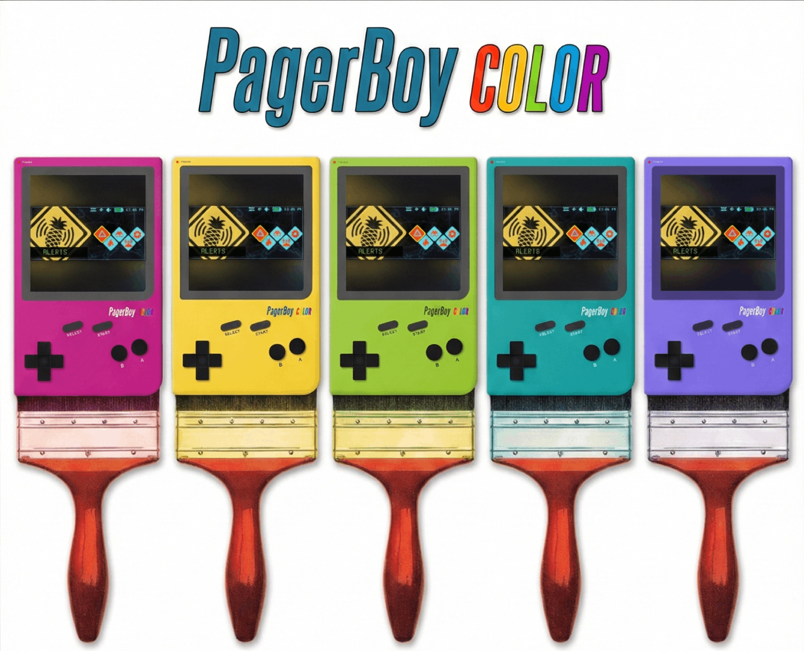
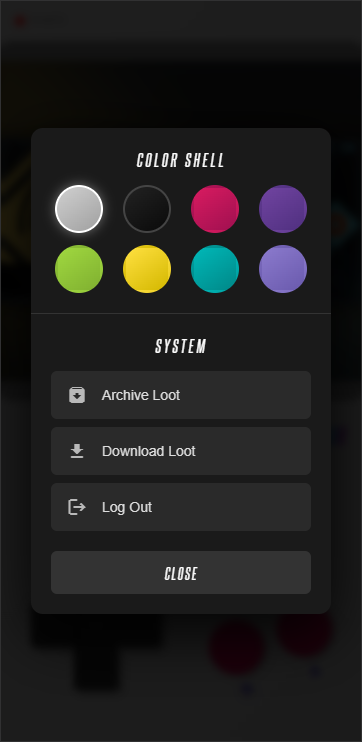
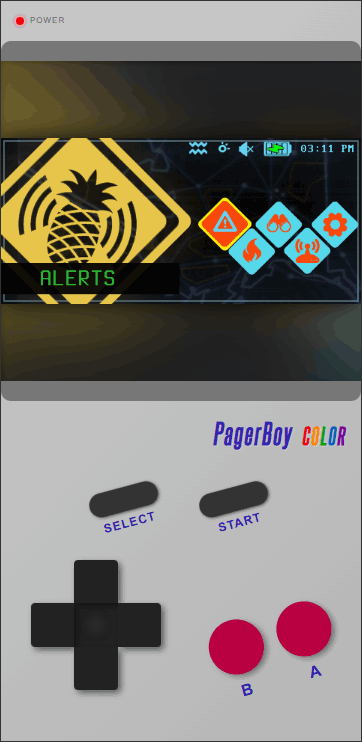

# 📟 PagerBoy COLOR
## *CLASSIFIED: FOR YOUR EYES ONLY!*

  

---

### 🕵️‍♂️ BECOME THE ULTIMATE SECRET AGENT!

**Psst! Hey you!** Yeah, you! Do you want to run secret missions right under everyone's nose?

Meet **PagerBoy Color**: The ultimate disguise for your WiFi Pineapple Pager. Turns your mobile phone or tablet into a **super-secret command center** that looks just like a retro handheld console!

While everyone else thinks you're just leveling up your character, you're actually running top-secret payloads. It's the perfect cover for field agents who need to hack in plain sight without blowing their cover. **It’s not just a theme... it’s your secret weapon!**

---

### 🚀 WHY YOU NEED IT

* **THE ULTIMATE DISGUISE:** Ditch the boring text menus that look suspicious. PagerBoy wraps your interface in a cool retro plastic shell.
* **CHOOSE YOUR COLOR:** Now available in **8 tactical colorways**, including Berry, Kiwi, Teal, and Atomic Purple!
* **REALISTIC HARDWARE:** Features a **pulsing power LED**, authentic plastic textures, and clicky buttons.
* **DAY & NIGHT MISSIONS:** Switch between the bright "Dandelion" look for day missions and "Stealth Black" for night raids.

---

### 📸 MISSION BRIEFING

#### STEP 1: CHOOSE YOUR LOADOUT
Launch the payload from your Pager menu. It instantly detects your current status.

| **The Color Shell** | **Live Action** |
|:---:|:---:|
|  |  |
| *Press **SELECT** to open the new Color Shell menu. Pick from 8 different casings to match your style or mission environment.* | *The new chassis features a realistic **Pulsing Power LED** that glows while you work. Press **START** to access the terminal.* |

 

#### STEP 2: DEPLOY TO THE FIELD
Once activated, refresh your browser. You are now undercover!

  
   
  <i>Tactical interface in action. Perfect for field operations.</i>

---

### 🛠️ AGENT INSTRUCTIONS (Simple Setup)

1.  **Copy the Files:** Move the entire `PagerBoy` folder onto your device here:
    `/root/payloads/user/general/PagerBoy/`
2.  **Check Your Gear:** Make sure both `payload.sh` and `index.html` are inside that folder.
3.  **Start the Mission:** Go to your Pager menu and click **PagerBoy**.
4.  **Activate:** Press the **UP** button.
5.  **Refresh:** Reload your web browser on your phone.
6.  **Select:** Customize your Shell Color.

**Mission Complete!** You are now rocking the PagerBoy interface.
*(Need to change colors? Press the **SELECT** button on the device!)*

  * This device will not self-destruct in 5 seconds. Batteries not included. No cheat codes required. *

