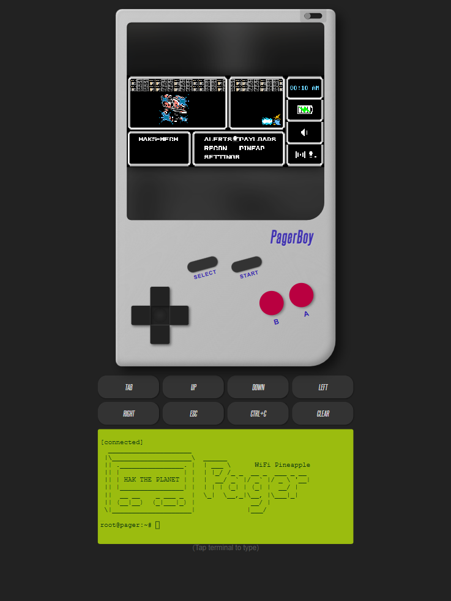
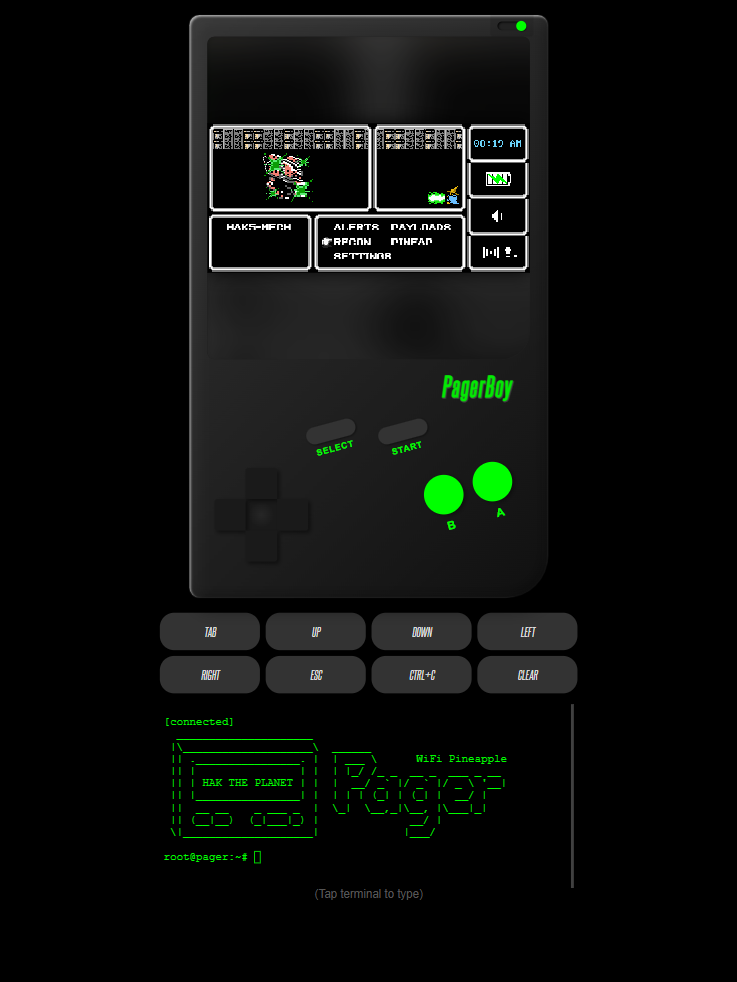
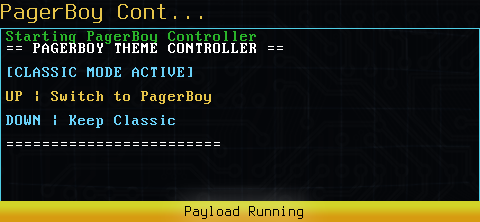
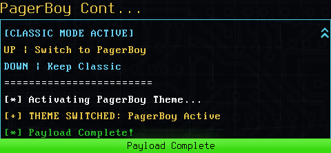
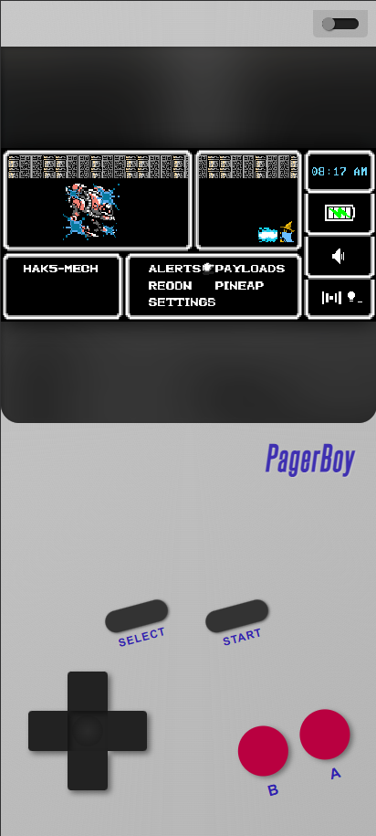
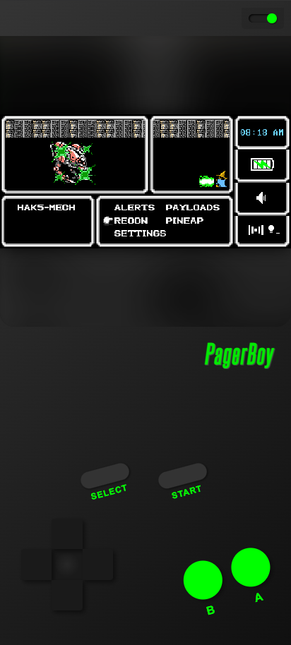

# 📟 PagerBoy - WiFi Pineapple Pager / Mobile Management UI
## *CLASSIFIED: FOR YOUR EYES ONLY!*

  
  

---

### 🕵️‍♂️ BECOME THE ULTIMATE SECRET AGENT!

**Psst! Hey you!** Yeah, you! Do you want to run secret missions right under everyone's nose?

Meet **PagerBoy**: The ultimate disguise for your WiFi Pineapple Pager. Turns your mobile phone or tablet into a **super-secret command center** that looks just like a retro toy!

While everyone else thinks you're just leveling up your character or playing a game, you're actually running top-secret payloads. It's the perfect cover for field agents who need to hack in plain sight without blowing their cover. **It’s not just a theme... it’s your secret weapon!**

---

### 🚀 WHY YOU NEED IT

* **THE ULTIMATE DISGUISE:** Switch from the classic pager UI that looks suspicious. PagerBoy wraps your interface in a cool retro plastic shell.
* **POCKET-SIZED POWER:** Designed specifically for your **mobile phone screen**. It fits right in your hand for hiding in plain sight.
* **DAY & NIGHT MISSIONS:** Switch between the classic "Grey Ghost" look for day missions and the "Stealth Black" mode for night raids.
* **SATISFYING GAMEPLAY:** Mash those big, chunky buttons just like you did as a kid!

---

### 📸 MISSION BRIEFING

#### STEP 1: CHOOSE YOUR LOADOUT
Launch the payload from your Pager menu. It instantly detects your current status.

| **Identify Status** | **Engage Disguise** |
|:---:|:---:|
|  |  |
| *The menu tells you if you are currently undercover.* | *Press **UP** to activate PagerBoy. Press **DOWN** to go back to classic mode.* |

 

#### STEP 2: DEPLOY TO THE FIELD
Once activated, refresh your browser. You are now undercover!

| **Day Operations** | **Night Operations** |
|:---:|:---:|
|  |  |
| *Classic handheld look. Innocent. Nostalgic.* | *Tactical mode. Perfect for late-night hacking sessions.* |

---

### 🛠️ UI INSTRUCTIONS

* **Select** - Main Menu / Download and Archive Loot
* **Start** - Move cursor to Terminal / Press Enter to Start typing

---

### 🏆 SHOUT-OUTS

🌟 **FIELD REPORT:**
A massive thank you to [**f3bandit**](https://github.com/f3bandit)! That awesome **Final Fantasy** theme you see on the screens? That's their work. It makes the WiFi Pineapple look perfectly innocent in the field.

---

  * This device will not self-destruct in 5 seconds. Batteries not included. No cheat codes required. *

