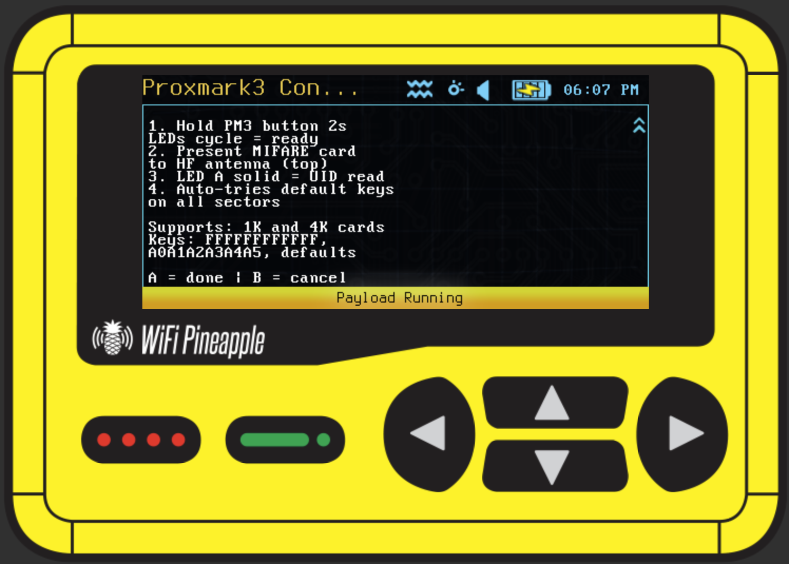

# Proxmark3 Controller

> Detect and guide Proxmark3 RDV4 standalone operations from the WiFi Pineapple Pager — LF/HF card reading, cloning, sniffing, and attacks.

**Author:** Samxplogs — [GitHub](https://github.com/samxplogs) · [YouTube](https://www.youtube.com/@samxplogs)

> **Note:** This is a **standalone mode guide** — the Pager detects the Proxmark3, provides step-by-step instructions, and logs sessions. All RF operations run on the PM3 hardware itself. Full client-side commands (read/write/emulate) would require cross-compiling the `pm3` client for MIPS.

---

## What it does

Detects a Proxmark3 RDV4 connected via USB (`/dev/ttyACM*`), displays device info, and provides an interactive D-pad menu to guide standalone mode operations for both LF (125 kHz) and HF (13.56 MHz) cards. Internal Pager devices (CH347F) are automatically skipped. Every action is logged to `/root/loot/proxmark/`.

Inspired by the need for a fieldable RFID tool without carrying a laptop — the Pager becomes a pocket-sized Proxmark3 controller.

---

## Usage

| Step | Action |
|------|--------|
| 1 | Connect Proxmark3 RDV4 to the Pager via USB |
| 2 | Launch from **User Payloads > General** |
| 3 | PM3 auto-detected on `/dev/ttyACM*` |
| 4 | **UP** for LF operations, **DOWN** for HF operations |
| 5 | Select an operation from the submenu |
| 6 | Follow the step-by-step guide on screen |
| 7 | Use the PM3 button to trigger standalone mode |
| 8 | Press **A** when done, **B** to go back |

**Main menu:**

| Button | Action |
|--------|--------|
| UP | LF Operations (125 kHz) |
| DOWN | HF Operations (13.56 MHz) |
| LEFT | Quick Reference (card types + PM3 button usage) |
| A | Device Info (USB descriptors) |
| B | Exit |

**LF operations (125 kHz):**

| Button | Operation | Standalone Mode |
|--------|-----------|-----------------|
| UP | Read EM4100 | `LF_EM4100RSWB` |
| DOWN | Read HID Prox | `LF_ICEHID` |
| LEFT | Clone to T5577 | — |
| RIGHT | Brute force HID | `LF_HIDBRUTE` |
| A | Sniff LF | — |

**HF operations (13.56 MHz):**

| Button | Operation | Standalone Mode |
|--------|-----------|-----------------|
| UP | Read MIFARE Classic | `HF_CRAFTBYTE` |
| DOWN | Sniff ISO14443A | `HF_14ASNIFF` |
| LEFT | Attack MIFARE (key recovery) | `HF_COLIN` |
| RIGHT | Read iCLASS | `HF_ICECLASS` |
| A | Clone MIFARE | — |

**LED indicators:**

| LED | Meaning |
|-----|---------|
| Cyan Solid | PM3 connected, ready |
| Green Blink | Standalone operation in progress |
| Yellow Solid | Submenu navigation |
| Red Blink | No PM3 detected / disconnected |

---

## Notes

- **Standalone mode guide** — the Pager displays instructions while the Proxmark3 RDV4 handles all RF processing on its own ARM chip
- **Auto-detection** — scans `/dev/ttyACM*`, walks sysfs for USB descriptors, skips the Pager's internal CH347F (VID 1A86 PID 55DE)
- **Disconnect handling** — detects PM3 removal mid-session and waits for reconnection
- **Session logging** — every menu selection and operation is timestamped in `/root/loot/proxmark/pm3_session_*.log`
- **Zero CPU overhead** — the Pager is only a display/controller, all RF work runs on the PM3
- **PM3 RDV4 button**: hold 2s to enter/exit standalone mode, short press to cycle sub-modes
- **Antennas**: bottom = LF (125 kHz), top = HF (13.56 MHz)
- Standalone modes must be compiled into the PM3 firmware — check your Iceman build configuration
- Captured data is stored in PM3 flash memory — retrieve with the `pm3` client on a computer
