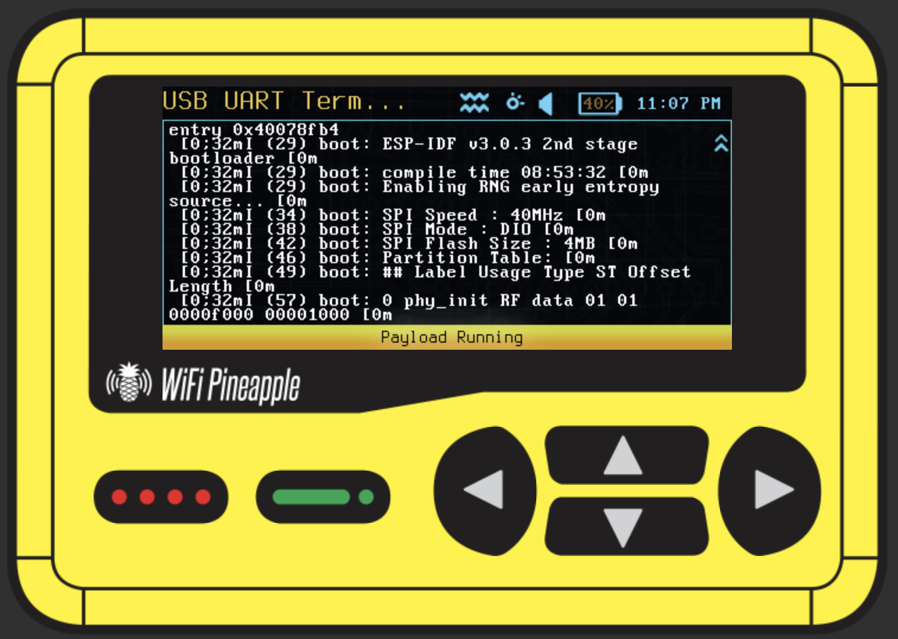

# USB UART Terminal

> Display serial output from a USB UART adapter on the WiFi Pineapple Pager screen.

**Author:** Samxplogs — [GitHub](https://github.com/samxplogs) · [YouTube](https://www.youtube.com/@samxplogs)

> **Note:** This is currently a **viewer-only** solution — it displays incoming serial data on screen but does not support sending commands to the connected device. Transmit (TX) functionality may be added in a future update.

---

## What it does

Reads data from a USB-to-serial adapter (FTDI, CH340, CP2102, CDC-ACM, etc.) and displays it line-by-line on the Pager's scrollable screen. The only configurable option is the baud rate, selected with the D-pad before the connection starts. Internal Pager devices (CH347F) are automatically skipped.

Inspired by the Flipper Zero [UART_Terminal](https://github.com/cool4uma/UART_Terminal), adapted for USB adapters on the WiFi Pineapple Pager.

---

## Usage

| Step | Action |
|------|--------|
| 1 | Connect a USB UART adapter to the Pager |
| 2 | Wire adapter RX → target TX, GND → GND |
| 3 | Launch from **User Payloads** |
| 4 | Adapter auto-detected (`/dev/ttyUSB*` or `/dev/ttyACM*`, internal CH347F skipped) |
| 5 | **UP/DOWN** to select baud rate (default 115200) |
| 6 | **A** to confirm and start reading |
| 7 | Serial output scrolls on screen |
| 8 | **B** to exit |

**Supported baud rates:** 9600 · 19200 · 38400 · 57600 · **115200** · 230400 · 460800 · 921600

**LED indicators:**

| LED | Meaning |
|-----|---------|
| Red Blink | No USB serial device found |
| Yellow Solid | Selecting baud rate |
| Cyan Solid | Terminal active |

---

## Notes

- **Viewer only** — displays incoming serial data, does not send commands (TX support planned)
- **Persistent connection** — the serial port stays open for the entire session, preventing DTR resets and data loss
- **Auto-detection** — dynamically scans all `/dev/ttyUSB*` and `/dev/ttyACM*` devices, skips the Pager's internal CH347F (VID 1A86 PID 55DE)
- **Line-buffered** — accumulates data and displays on `\n` or `\r`; flushes at 80 chars if no line ending arrives
- **No flow control** — RTS/CTS and XON/XOFF are not configured
- Supported adapters: CP210x, FTDI, CH340/CH341, PL2303, CDC-ACM (STM32, Arduino, etc.)
- Serial port configured as 8N1 (8 data bits, no parity, 1 stop bit)
