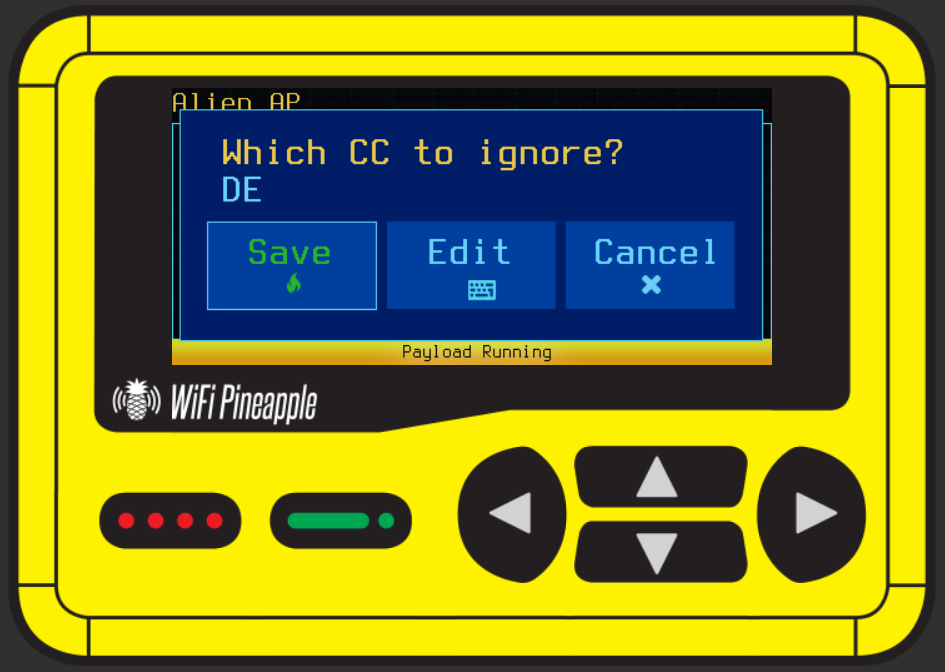

# "Alien AP" Reconnaissance Payload

Find APs around you that broadcast country codes that do not match your own.
This could be an indication of imported hardware, someone trying to increase their transmit power, a misconfigured AP or even a rogue AP.

# How to use
Install the payload and execute it on your WiFi Pineapple Pager.
Make sure you have a wireless interface in monitor mode (default: wlan1mon).
The script will prompt you to enter the country code you want to ignore (e.g., "US" for United States, "DE" for Germany).

The script will now read Beacon frames and alert you when it finds an AP broadcasting a different country code.

APs will only pop up once, even if they broadcast multiple Beacons.
You can see all detected APs in the log of the payload.

# How it works
This payload uses `tcpdump` and `awk` to monitor Beacon frames.
It extracts the SSID and Country Information from the frames and logs them.
If the country code matches a specified value, it ignores that frame.

`tcpdump` is filtered to only capture Beacon frames.
Finding the country code is tricky, as it is in a variable part of the frame.
This payload uses alot of `awk` magic to find the country code in the frame, false positives are still possible.
The `awk` filter searches for fields starting with `07 xx AA BB` where `xx` is the length of the country code field, and `AA BB` is the ASCII code for the country.
Further checks are done to ensure that the country code is valid ASCII and not some random data with the same structure.

If `tshark` is installed, the payload could be implemented more reliably, as `tshark` can parse the 802.11 frames directly.